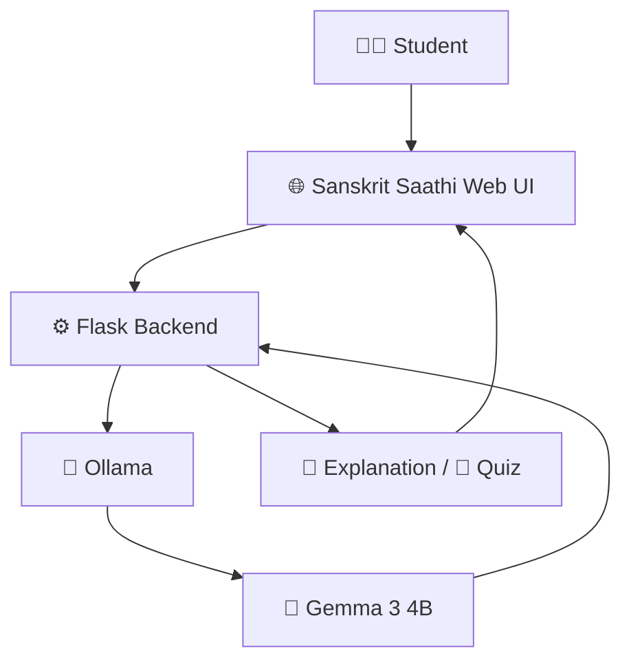

<div align="center">

# 🪷 Sanskrit Saathi

### Your AI study companion for Sanskrit & Ayurveda

*Understand Sanskrit. Learn Ayurveda. Study smarter.*


**An AI-powered Sanskrit study companion built for BAMS students.**
Runs fully on your own computer. No paid API. No cloud AI.

</div>

---

<!-- 📸 Add a screenshot here once you have one:

-->

## 🌿 What is Sanskrit Saathi?

Sanskrit can be hard for BAMS students who don't have a strong Sanskrit background. **Sanskrit Saathi** helps by turning any Sanskrit word, sentence or shloka into a clear, beginner-friendly lesson, then testing you on it.

Paste Sanskrit → get an explanation → take a quiz → repeat. 🔁

---

## ✨ Features

| | Feature | What you get |
|---|---|---|
| 📜 | **Sanskrit explanation** | A structured breakdown of any word, sentence or shloka |
| 🔤 | **IAST transliteration** | Accurate Roman script, generated with `indic-transliteration` |
| 🇬🇧 | **English meaning** | Simple, easy-to-read English |
| 🇮🇳 | **Hindi meaning** | Simple Hindi explanation |
| 🧩 | **Word-by-word breakdown** | See how each word builds the meaning |
| 📚 | **Context & usage** | Where and how the text is used |
| 🌿 | **General Sanskrit mode** | Pure Sanskrit learning |
| 🪷 | **BAMS Sanskrit mode** | Adds Ayurveda-focused context when relevant |
| 🧠 | **AI-generated quizzes** | Practice questions based on your text |
| 🔒 | **Local AI** | Open-weight model running on your machine |

---

## 🎛️ Two Study Modes

| Mode | Best for |
|---|---|
| 🌿 **General Sanskrit** | Learning Sanskrit words and shlokas on their own |
| 🪷 **BAMS Sanskrit** | Sanskrit studied in a BAMS / Ayurveda context |

Switch modes with the selector right above the **📖 Explain This** and **🧠 Quiz Me** buttons.

### 🧪 Try these

| Paste this | Then try |
|---|---|
| `आयुः` | 🪷 BAMS mode, then 📖 Explain This |
| `कर्मण्येवाधिकारस्ते मा फलेषु कदाचन।` | 🌿 General mode, then 🧠 Quiz Me |

The app also has a **Try an example** section. Clicking an example only fills the text box and doesn't send anything to the AI.

---

## 🤖 How the AI Works

Sanskrit Saathi uses **Gemma 3 4B** through **Ollama**.

The model runs **locally on your computer**, so your Sanskrit text isn't sent to a cloud AI service.



IAST transliteration is generated using the **indic-transliteration** library.

---

## 🛠️ Tech Stack

- 🐍 Python
- 🌶️ Flask
- 🌐 HTML, CSS, vanilla JavaScript
- 🦙 Ollama
- 🧠 Gemma 3 4B
- 🔤 indic-transliteration

---

## 🚀 Run Locally

> ⏱️ Setup takes about 10 minutes, mostly the model download.

### 1️⃣ Clone the repository

```bash
git clone <YOUR_GITHUB_REPOSITORY_URL>
cd sanskrit-saathi
```

### 2️⃣ Create a virtual environment

```bash
python -m venv venv
```

### 3️⃣ Activate it

**Windows (PowerShell):**

```powershell
.\venv\Scripts\activate
```

**macOS / Linux:**

```bash
source venv/bin/activate
```

### 4️⃣ Install dependencies

```bash
pip install -r requirements.txt
```

### 5️⃣ Install Ollama and download the model

Install [Ollama](https://ollama.com), make sure it is running, then download Gemma 3 4B:

```bash
ollama pull gemma3:4b
```

### 6️⃣ Start Sanskrit Saathi

```bash
python app.py
```

### 7️⃣ Open the app

👉 **http://127.0.0.1:5000**

> 💡 Responses can take a little while on a CPU-only machine, because the AI runs locally. The loading card shows that it's working.

---

## 🔌 API Reference

The frontend talks to two Flask endpoints.

### `POST /api/explain`

```json
{
  "text": "आयुः",
  "study_mode": "bams"
}
```

Returns:

```json
{ "answer": "AI explanation" }
```

### `POST /api/quiz`

```json
{
  "text": "आयुः",
  "study_mode": "general"
}
```

Returns:

```json
{ "quiz": "AI-generated quiz" }
```

`study_mode` accepts `"general"` or `"bams"`.

---

## 🩺 Troubleshooting

<details>
<summary><b>⚠️ "Something went wrong while connecting to Sanskrit Saathi"</b></summary>

<br>

Ollama is probably not running. Start Ollama, then try again. You can check it with:

```bash
ollama list
```

You should see `gemma3:4b` in the list. If it's missing, run `ollama pull gemma3:4b`.

</details>

<details>
<summary><b>🐢 Responses are slow</b></summary>

<br>

This is normal on CPU-only computers. Gemma runs entirely on your machine, so speed depends on your hardware. Closing heavy apps can help.

</details>

<details>
<summary><b>🔌 The page won't open</b></summary>

<br>

Make sure `python app.py` is still running in your terminal and that you're visiting `http://127.0.0.1:5000`.

</details>

<details>
<summary><b>📦 `pip install` fails</b></summary>

<br>

Check that your virtual environment is activated. You should see `(venv)` at the start of your terminal line.

</details>

---

## 🌱 Why Local AI?

Sanskrit Saathi uses an open-weight model locally through Ollama. This makes it possible to:

- 💸 Learn without depending on a paid AI API
- 🔒 Keep submitted Sanskrit text on your own computer
- 🧪 Experiment with different open models
- 🚫 Run the app without sending requests to a hosted AI provider

---

## 💡 Why I Built It

Sanskrit Saathi was built for a friend studying BAMS who struggled with understanding Sanskrit course material.

The goal was simple:

> **Make Sanskrit easier to understand while keeping the learning experience beginner-friendly and relevant to BAMS.**

---

## ⚠️ Disclaimer

Sanskrit Saathi is a **language-learning tool**. It is not a substitute for a Sanskrit teacher, a textbook, or a qualified medical professional.

Ayurvedic context provided by the app should be verified with appropriate academic sources and teachers.

---

## 📌 Project Status

✅ **MVP completed** and tested with a BAMS student.

---

<div align="center">

🌿 *Built with Flask + Ollama + Gemma*
*Designed for learning Sanskrit with open-weight AI.*

</div>

